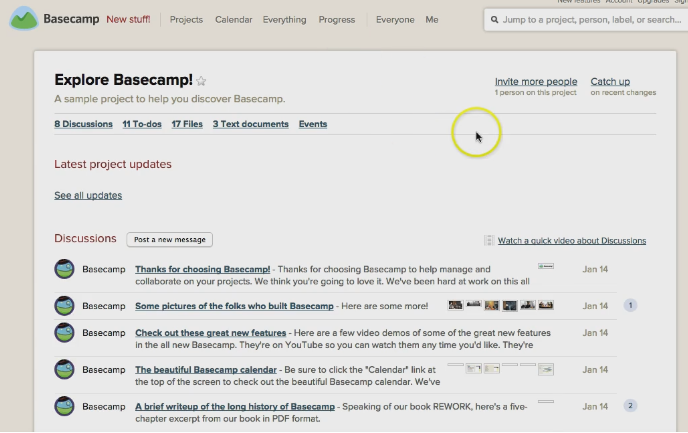

# Introduction

In the next steps, we're going to cover a couple of popular choices and talk about why they might work for you. The first one we're going to talk about is **Basecamp**.

# Overview of Basecamp

You've probably heard about Basecamp. Basecamp is a very common choice and it's almost considered industry standard at this point. It was one of the very first online project management tools and especially one of the very first ones that tried to be user friendly. A lot of the earlier ones were meant for very, very large businesses, so Basecamp was one of the very few options for small teams or freelancers that wanted to stay organized and were doing it online.

Basecamp is well suited to projects with an end date. That's probably one of the reasons that it caught on so well with agencies: it's really well-suited for one specific campaign, or for doing a website, for something with a very specific start and end date.

Basecamp is web-based, and it has iOS, Android, and Google Play apps, and the cost starts at $20 per month. All of the apps, however, are free.

# Potential deal breakers of Basecamp

Potential deal breakers of Basecamp are that it has no recurring tasks. It still astounds me that this feature had never been added because Basecamp has been around for about 10 years. And again, this probably comes back to their original target base, because if you're working, you know, if you're an agency, and you're mainly signing clients so that you can develop an app, or develop and launch an app, or do one marketing campaign, then you don't really need recurring tasks. But if you're running a business, then you this feature, because you have to check check email every Monday, or to process emails on Fridays and so on - you need some reminder of those.

# Best uses of Basecamp

So, the best uses for Basecamp are client-side dealings if they know Basecamp. If you're working with clients who aren't tech-savvy but are familiar with Basecamp, and they want an online space to organize everything, then Basecamp is a good choice for that, especially if it's a finite project. If this is a retainer client that you're going to be working with for the next year or more, and there will be things like recurring tasks, then Basecamp might not be the best thing.

Basecamp is built for teams. It's easy to get used to its features. So it's good if you work with people who don't necessarily have a lot of experience with online tools.

# Explore Basecamp

Let's see what Basecamp looks like from the inside.

This is the list of the projects and I have one trial project here. 

I've opened my project. As you see, there are discussions and to-do lists.

You can change the due date on a to-do list just by clicking on it. You can also change the assignee. Tasks can be added as well.

Then you can attach files.

All of the files for the project are displayed here no matter where you added them. There are text documents that you can save and edit.

There is also the events, which is basically the calendar. You can set calendar so that it syncs with Google Calendar. This way you can get reminders on your phone about the upcoming events.

This is what a discussion looks like. You can attach the files, and it shows up back on the files screen on the project.

Basecamp also has project templates, which, makes it really good for people who do finite projects.

Even if you use Basecamp for working with client projects, I would still definitely recommend that you use something else or that you set up a Basecamp project for your business.