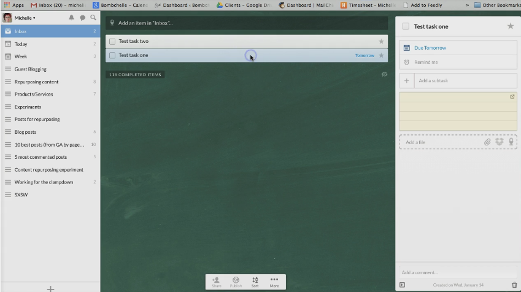
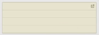
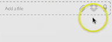
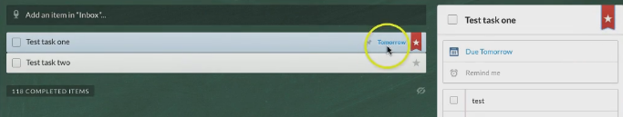
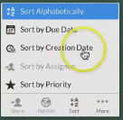

# Introduction

At this step we are going to talk about Wunderlist. This is a very popular app and it was actually voted best app in the Mac Store in 2013.

# Overview of Wunderlist

Whereas Basecamp and Asana are full-fledged project management tools, Wunderlist is a little more task management. It does have several features though. If you're familiar with Getting Things Done, by David Allen, and you want to use a system similar to that, to sort of keep yourself productive and on task, then Wunderlist can really easily work with that.

There are pro and business upgrades that start at $5 per user per month, but even the free version is pretty full featured.

There are desktop apps for Mac and Windows, and I believe that's the only one we've covered out of these three popular choices that has a desktop app. So if you are one of those people who is often working on a computer without the Internet access, then this might be something to consider. There is also a web version, and there are iOS and Android apps. The product as a whole is very well designed.

# Potential deal breakers of Wunderlist

Potential deal breakers are mainly that it's list based: there's not really any calendar view, and because of the way that the lists are set up, it could be very easy to get shortsighted. With Wunderlist it's a little hard to get a very big picture view of the next couple of months.

# Best uses of Wunderlist

The best uses for Wunderlist are for a solo worker or a small team. It'll work really well for someone who doesn't mind the list view.

# Explore Wunderlist

This is how Wunderlist looks like. You see there is a list of tasks and you can change due date easily or set it to repeat. So Wunderlist does has recurring tasks, unlike Basecamp. You can set it repeat daily, monthly, yearly or custom. And if you have the app installed or if you have it set to sync to a calendar, then it will ping you on your phone and make sure that you actually get the task done.

You can add sub-tasks easily.

You can add notes here and even open full screen for the notes.

You can attach files from your computer or from Dropbox, or you can record a note to go with it, and you can add a comment.

So technically Wunderlist is more task management oriented, but it really has a lot of project management based features. You can star things to mark it as priority, and that automatically moves it to the top of the list. You can easily rearrange the tasks with drag-and-drop.

You can email the list or print the list. You can sort it by alphabetically, due date, creation date, or priority, or signee.

One of the things that I like is that you can change the background. Becoming a pro user lets you have more backgrounds. After becoming pro, you also get an unlimited assigning, you can add unlimited files of any size and get unlimited subtasks.