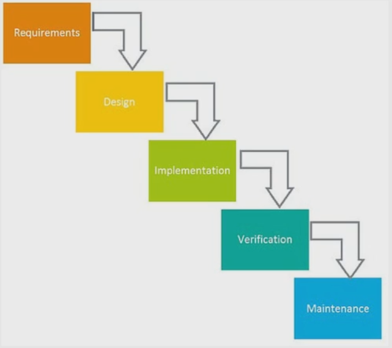

# Introduction

At this step we will discuss **Waterfall** project management.

# Overview of Waterfall project management

This diagram shows you the flow of Waterfall project management. One of the things you'll notice is that there are no circles or feedback loops here. Waterfall is the oldest of the methods that we've covered and it's kind of out of fashion now which is why it's last in this series. Waterfall got started in manufacturing and construction industries where you're creating a physical product. In such industries it's very difficult, if not impossible, to go back and change things by taking new feedback into account. For example, when you're building a house, after you already have the whole framework up, the walls, you can't just move a wall to another place. So, once software development industry emerged, people needed a way to manage this and Waterfall methodology got adapted, because literally that was the only thing that existed.

Waterfall is sequential, not cyclical or iterative, which means that you're planning the whole project out at the start and you're doing it step by step, and there's no feedback loop. One of the main ideas is big design up front. You'll have to make sure each phase is 100% complete and absolutely correct before you move to the next stage. So before you ever start design, the program requirements need to be set in stone, because there's no going back and changing those requirements later.

# Pros and cons of Waterfall

In theory, time spent planning early on can save time later, and some people actually argue that Waterfall is more disciplined and easier to understand. However, David Parnas said that many of the system's details only become known to us as we can progress in the implementation. So by its very nature, some of the things that we learn while designing and implementing, invalidate our design and you have to backtrack.

So Waterfall, has definitely fallen by the wayside in favor of the other methods that we've covered here: Lean, Agile, Scrum.

# How Waterfall applies to freelance work?

A lot of us instinctively plan projects following Waterfall methodology, but it's not necessarily the best way to plan. Most of the other project management methods that we've talked about can't really be adapted wholesale into a freelance business, but at the same time, sticking with Waterfall project management system has its own pitfalls as well. So basically you need to create your own system based on what works for you and your business, which is something we're going to get into. It's good to be aware of the potential shortcomings of Waterfall and of planning this way so you can stop yourself from falling into those pitfalls when you or your client slip into that mode of planning by default.